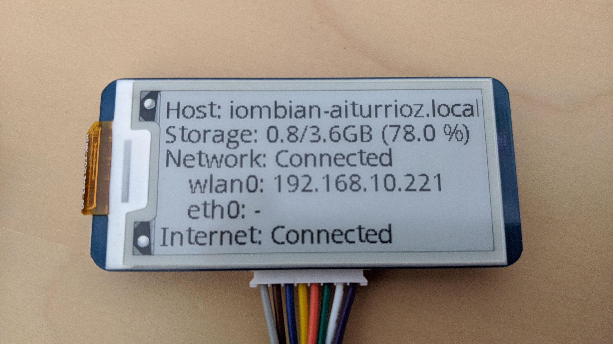

# IoMBian Status Display

This service displays device status info on a ePaper display ([Waveshare 2.13 e-Paper HAT](https://www.waveshare.com/product/displays/e-paper/epaper-3/2.13inch-e-paper-hat.htm)).

The following information is shown:

- Hostname
- Storage (used, total and percent)
- Local network connection status (ip address for each interface)
- Internet connection status

[](./docs/iombian-status-display.jpg)

## Display connection

The Waveshare 2.13 e-Paper display uses the SPI protocol to communicate with the board. The connection with the Raspberry Pi should be done using the following table ([source](https://www.waveshare.com/wiki/2.13inch_e-Paper_HAT)):

| e-Paper | Raspberry PI |
|:-------:|:------------:|
|   VCC   |   1 (3.3V)   |
|   GND   |    9 (GND)   |
|   DIN   |      19      |
|   CLK   |      23      |
|    CS   |      24      |
|    DC   |      22      |
|   RST   |      11      |
|   BUSY  |      18      |

## Installation

> Warning: SPI should be first enabled in the board! (raspi-config) 

- Clone the repo into a temp folder:

> ```git clone https://github.com/Tknika/iombian-status-display.git /tmp/iombian-status-display && cd /tmp/iombian-status-display```

- Create the installation folder and move the appropiate files (edit the user):

> ```sudo mkdir /opt/iombian-status-display```

> ```sudo cp requirements.txt /opt/iombian-status-display```

> ```sudo cp -r src/* /opt/iombian-status-display```

> ```sudo cp systemd/iombian-status-display.service /etc/systemd/system/```

> ```sudo chown -R iompi:iompi /opt/iombian-status-display```

- Create the virtual environment and install the dependencies:

> ```cd /opt/iombian-status-display```

> ```sudo apt install python3-dev```

> ```python3 -m venv venv```

> ```source venv/bin/activate```

> ```pip install --upgrade pip```

> ```pip install -r requirements.txt```

- Start the script

> ```sudo systemctl enable iombian-status-display.service && sudo systemctl start iombian-status-display.service```

## Author

(c) 2020 [Tknika](https://tknika.eus/) ([Aitor Iturrioz](https://github.com/bodiroga))

Licensed under the Apache License, Version 2.0 (the "License");
you may not use this file except in compliance with the License.
You may obtain a copy of the License at

    http://www.apache.org/licenses/LICENSE-2.0

Unless required by applicable law or agreed to in writing, software
distributed under the License is distributed on an "AS IS" BASIS,
WITHOUT WARRANTIES OR CONDITIONS OF ANY KIND, either express or implied.
See the License for the specific language governing permissions and
limitations under the License.