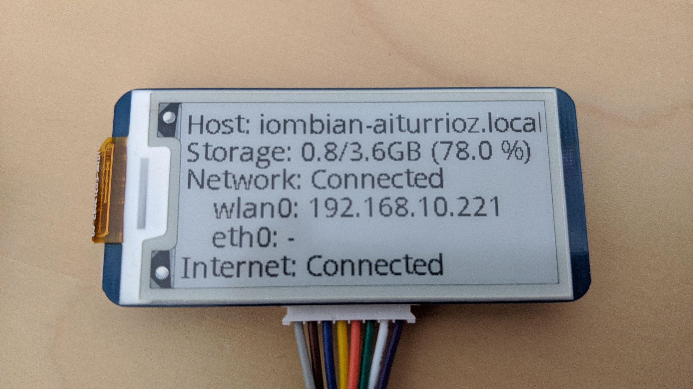

# ePaper Display

This module displays device status info on a ePaper display ([Waveshare 2.13 e-Paper HAT](https://www.waveshare.com/product/displays/e-paper/epaper-3/2.13inch-e-paper-hat.htm)).

## Display connection

The Waveshare 2.13 e-Paper display uses the SPI protocol to communicate with the board. The connection with the Raspberry Pi should be done using the following table ([source](https://www.waveshare.com/wiki/2.13inch_e-Paper_HAT)):

| e-Paper | Raspberry PI |
|:-------:|:------------:|
|   VCC   |   1 (3.3V)   |
|   GND   |    9 (GND)   |
|   DIN   |      19      |
|   CLK   |      23      |
|    CS   |      24      |
|    DC   |      22      |
|   RST   |      11      |
|   BUSY  |      18      |