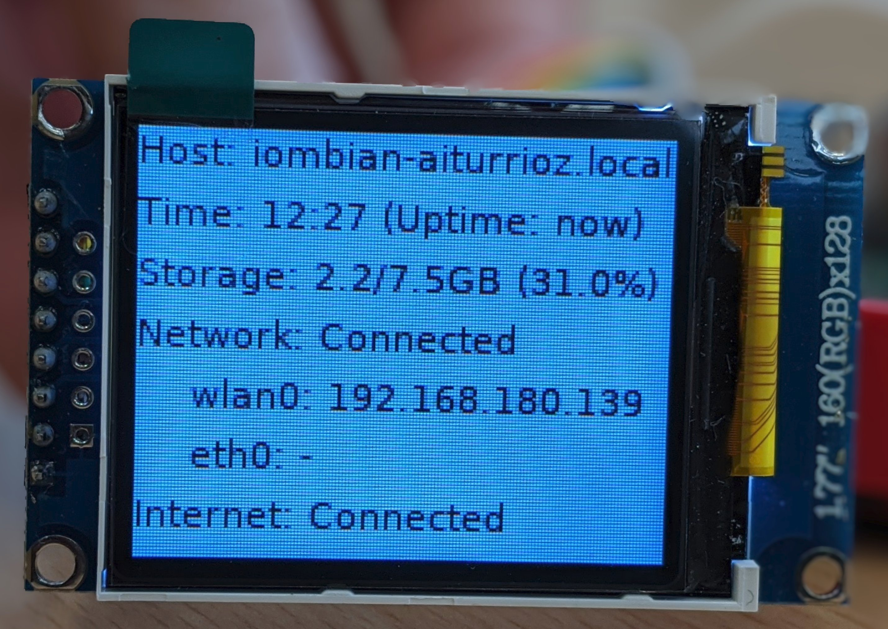

# ST7735 Display

This module displays device status info on a ST7735 display ([1.77 128x160 TFT](https://www.winstar.com.tw/es/products/tft-lcd/module/tft-st7735.html)).

## Display connection

The TFT 1.77 display uses the SPI protocol to communicate with the board. The connection with the Raspberry Pi should be done using the following table:

|  Display      |  Remark       |   IoM2040     |
|:--------:     |:-------:      |:-----------:  |
|  1 (GND)      |   GND         |   25 (GND)    |
|  2 (VCC)      |   VIN         |   4 (5VDC)    |
|  3 (SCK)      | SCK/CLK       | 23 (GPIO11)   |
|  4 (SDA)      |   MOSI        | 19 (GPIO21)   |
|  5 (RES)      |   RST         | 18 (GPIO24)   |
|  6 (RS)       |   D/C         | 22 (GPIO25)   |
|  7 (CS)       |    CS         |  24 (GPIO8)   |
| 8 (LEDA)      |  BLight       |  1 (3.3VCD)   |